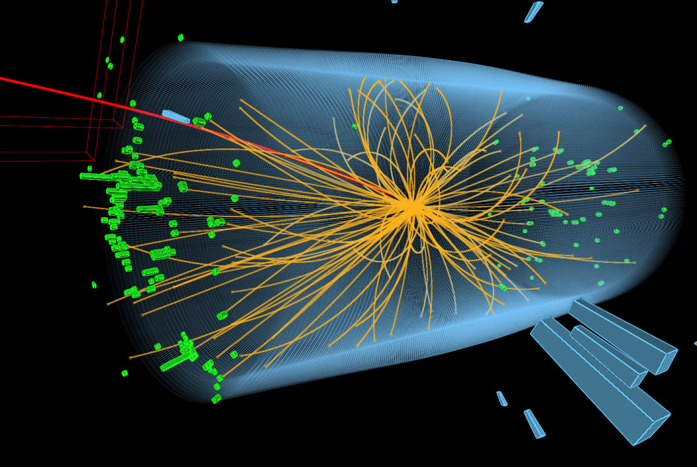
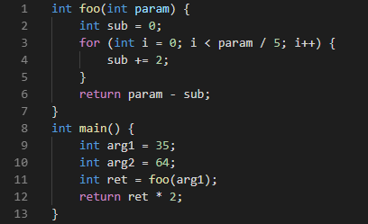
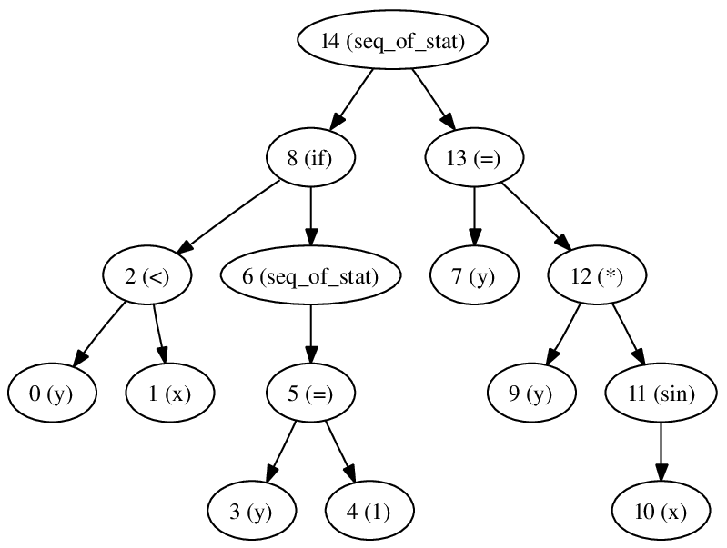
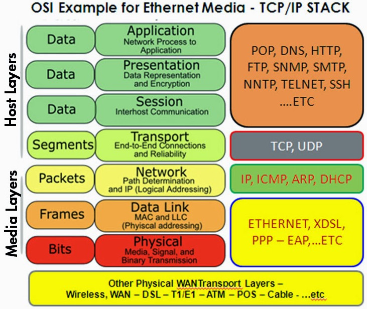
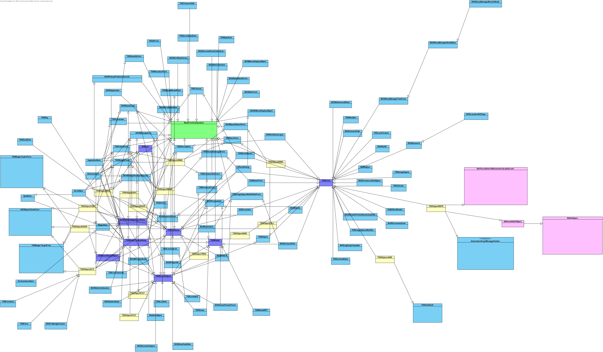
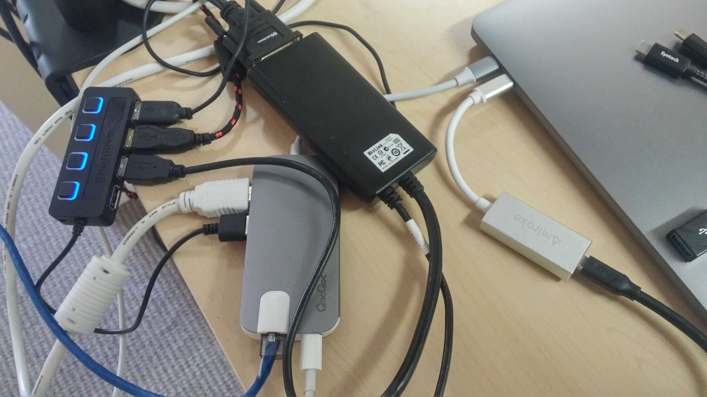
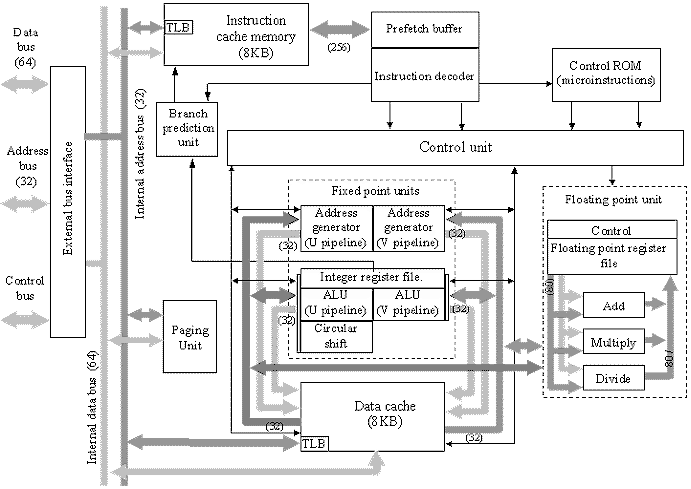
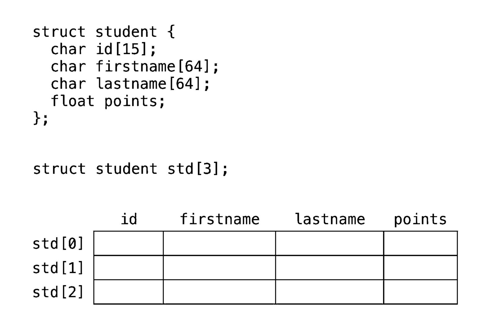
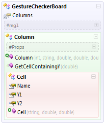

# The Effect of Interfaces on Code

In every theory, math or science, there are some basic assumptions that we need to take for granted before we can do anything else. We try to prove these assumptions with experiments, formal proofs, and other theories. Some basic assumptions can never be proven, and we call them metaphysical, like the existence of a supreme being who controls everything behind our back, or natural laws that govern everything deterministically. You can't prove that everything is fully deterministic, and you can't prove that God exists or doesn't. You can't prove that your program will halt, and you can't prove that the operating system didn't do something funky to your memory when you weren't looking. You just take it for granted because then you can create knowledge and make decisions. You just need some basic rules to even think about something. And someone or something has to make those rules.

For example, you can't make a program without a programming language. Someone has to decide on the syntax and the features. You can't make a program without a compiler or interpreter. Someone has to decide how to turn the syntax into machine code. You can't run a program without microchips. Someone has to decide how the machine code changes the physical state of the processor. You can't change the physical state of the processor without knowing the laws of physics. Someone has to figure out how physics, chemistry, and electricity work.

Likewise, you can't change the value of a variable before you decide the type of that variable. Yes, I know that dynamic types exist, bear with me. You can't call a function without deciding what parameters, return values, and statements it has. Yes, I know that dynamic binding exists, keep bearing with me. You can't make a program without deciding how it gets data from the outside, how it uses that data, and how it gives data back. You have to make decisions about the way something works before you can use it. And those decisions limit how you can use it.

The point of everything so far was to emphasize that systems are built up of many layers of decisions. Those decisions have obvious and less obvious effects. We call those effects "constraints", because they constrain and restrict what the other parts of the system can do. When they're useful, and we call them guarantees. When they're not, and we call them limitations and defects. Sometimes they are both, depending on how you look at it. In any case, they way they work is they sacrifice freedom and power in one area, to gain freedom and power in another area. The amount of freedom sacrificed and the power gained can vary wildly. Sometimes you get a lot of power while losing very little freedom. Other times you actually lose power along with freedom.

Higher level constraints depend on lower level constraints. The boundary between higher and lower level constraints is not always obvious, but sometimes we find a way to draw a line of separation, and we call that line an interface. That interface lets us pretend that we are not affected by the lower level constraints, so we call them implementation details. We can use that freedom to change the implementation without affecting the users. We can pretend that the other constraints don't even exist. If you know how the Internet or any other protocol stack works, the OSI model is a good example of layered interfaces allowing each layer of abstraction to not care about the others.

Pretending can be useful, and can greatly simplify some problems. But sometimes the constraints change and a mismatch occurs at the interface. Sometimes, the mismatch is so bad that without changing the interface, it's gonna be really messy. We're gonna need way more workarounds and extra constraints than we'd like, in both directions. So we would rather just change the interface. That's exactly what we did with text-based HTTP, turning it into binary HTTP/2, and [some people](https://braid.news/protocol) are experimenting with adding publish-subscribe features to HTTP/3 to make [incremental updates](https://josephg.com/blog/api-for-changes/) easier. An example of workarounds that just made everything more complex and brittle are [Network Address Translation](https://en.wikipedia.org/wiki/Network_address_translation#Issues_and_limitations), [DHCP](https://en.wikipedia.org/wiki/Dynamic_Host_Configuration_Protocol#Security), and [BGP](https://en.wikipedia.org/wiki/BGP_hijacking#Public_incidents).

But changing an interface is not without cost. When we change an interface, everything that depended on that interface will have to change, as well. When your trusty PS/2 mouse that's served you for 30 years breaks, you have to buy a new computer because the old one doesn't support the fancy new USB3 mouses. When Apple decides that you don't need an audio port anymore, you have to buy an adapter. In code, when we need to change how a function works, we might not have the right data for it, so have to add a new parameter. And when the function gets called in many places, those calls need to put something as that parameter. The calling functions might not have the right data in a format that fits the new parameter, so they might have to change how they work, and the cycle repeats again. So a change in one function can force changes in other functions, in both directions, and through multiple calls.

We have to be careful about how we make those changes. For each interface, we have to think about whether it's more costly to change it or to create workarounds where it's used. If we're not careful, we will make the interfaces too complex or we will write too much code. Both of those can create more mismatches that demand more changes, creating a vicious feedback loop.

That's the essence of software bloat. Lots of complicated interfaces and lots of code. The next time someone says "Oh, I know how you can solve it, just create another interface!", you should be very skeptical.

In code, an interface can be a primitive data type, a function signature, a compound data structure, or in the case of classes, a data structure and a group of functions that operate on it. An interface defines the rules that both the user and the implementation must follow, what they can do and what they can't. It tells us what is explicit and hints at what might be implicit. For example, the type of a function parameter is explicit, and the variables that can be used as arguments in the calling function are implicit, as in, they are not directly expressed as part of the interface, but they can still influence it.

The idea of explicit and implicit constraints is important to emphasize. Interfaces are explicit, like a 3.5 millimeter audio port, but the things that can connect to it, like headphones and speakers, are implicit. The devices that have an audio port, like phones and laptops, are also implicit. But more important and less obvious is that one side has to produce an analog signal and the other side has to use it somehow. It doesn't matter how it's used or created, I mean, people have used it to control lasers in resin-based 3D printers, but the main rule is that the signal has to be analog and continuous. It can't be digital and intermittent. That has a big effect on what it can be used for.

Audio is a simple example, but it still has more implicit rules than explicit ones. For example, electrical fields from other equipment can cause interference and degrade the signal, resulting in noise that can ruin the home cinema experience. The same effect happens in other electrical devices, which can break when the designers don't care about implicit rules and the context in which their device runs. We have even created standards that are rigorously enforced to stop printers from spontaneously combusting and setting banks on fire. 

Every interface and rule creates one set of constraints by expressing them directly, which we call explicit, and another set of constraints by interacting with other rules, which we call implicit. If we want to make decisions fast and easy, we have to minimize the amount of implicit rules we have to think about, and how easily they get created. Some implicit rules we can infer from the context, and those are fine, as long as there are few of them. But every time we make a new rule, we should think about the implicit constraints that we are creating, and which old rules our new one interacts with to make that happen. We can also think about how the new rule might affect any future rules. In general, the smaller the amount of rules that interact with each other, the easier it is to do things.

Here is an example of what happens when you don't do that.

Let's look at how the lower level constraints in a program build up into the higher level constraints. We're not gonna talk about how the CPU works, even though that's very interesting and useful. The image is only to illustrate the basic low level constraints that most programmers today seem to ignore. The amount of components and their interactions look scary, but trust me, software is way worse. The diagram with lots of tiny blue boxes from before was a small part of the class diagram for the popular video game Skyrim. But who knows, maybe it has to be that complex.

A program needs to make decisions based on the values of variables. Those variables need to be represented somehow. We currently use electrical switches with two possible states to represent yes/no answers, and we use sequences of them to represent integers and real numbers. We call the yes/no answers bits, and we call the sequences data of a certain type. This is the first level of abstraction, and the first interface. This is the place where we pretend that integers are characters of text or pointers to other data. The lower level language is machine code, and the higher level language is, well, a higher level language like C or Java bytecode. We do as much as we can in the space between those interfaces, to make them as flexible as possible. That part is important, and we'll come back to it later.

A data type is limited by the information it can contain. An integer type can contain 1 and 2, but not 0.5. Likewise, a floating point type can contain 0.5 but not of 0.1, because it has a [repeating decimal](https://www.exploringbinary.com/why-0-point-1-does-not-exist-in-floating-point/) in the bit sequence. Weird rule, I know. We'll come back to it later.

Primitive data types use a limited amount of memory, so there are certain values they can't represent. We can change that by using compound data structures, and putting data of different types into a sequence, just like primitive types put bits into a sequence. We can also use abstract data types, which work like data structures except they call functions under the hood. And we can allocate memory dynamically, for example in dynamic arrays. This is also a level of abstraction, but the effects are not as easy to understand and usually not that important, so we're not gonna bother, for now.

Like we said before, a function that takes certain types of parameters and returns a certain type of result is limited by how the data contained in those types can be used. This is the second level of abstraction, cutting part of a program out into a function, which is a group of actions that can do whatever they want, as long as they take data of a certain type in and give data of a certain type out. The types of the data are explicit, and the content of the function and the caller is implicit. Like the first level of abstraction, the more we do between the input and output interfaces, the more flexible the abstraction will be. There are some exceptions, which we will talk about next.

The implementation of a program is limited by the division of labor into functions, data structures, and modules. Most programs are a combination of many algorithms, not just one. That is, they use one technique to do one thing, and feed the result into another technique that gets another result, and that's repeated with as many algorithms as needed. The techniques are usually self-contained and can thus be separated into their own functions. The algorithms themselves have parts where the data is temporarily in an invalid state, and parts where the data is guaranteed to be in a valid state. The invalid state means that more data is required to put the data back into a valid state. Usually that means you are in the middle of a really complex procedure and need to store a lot of context in local variables. The valid state just means you have the smallest amount of data to be able to change it into another valid state.

The best place to cut an algorithm to make your functions and data structures is the place where the data is in a valid state, and there is very little context that you have to pass around. In general, the fewer functions and data structures you have, that is to say, the fewer interfaces you have, the more flexible your program will be. Imagine how big and complicated FizzBuzz would be if every statement was in its own function. It would be pretty hard to change it, as well, because of all the explicit arguments and parameters. This is what we meant when we said "do as much work as possible". By the way, I recommend writing FizzBuzz in that contrived way yourself, it's pretty fun and educational.

@Cross-cutting concerns

@Patriot missile floating point error

If you make too many things explicit, you won't get the ability to make other things implicit, because there's other code that already makes them explicit. Unless you delete the code that makes things explicit, you will need extra data members and hacks to gain back the ability to make things implicit. This is called over-abstraction, and it can be hard to notice when you are already familiar with the codebase and have adopted a specific programming style and consider it normal. There are lots of ways to hide complexity created by over-abstraction. You might split the abstractions into smaller units so that it looks cleaner, but you won't solve the actual problem of too many explicit and interdependent abstractions. You are more likely to make it worse. 

Every time you make something explicit, like the type of a variable, or the place where you cut the program to make a function, you limit what you can do with it, in order to get some useful guarantees and freedoms in other areas. This is all fine and good when you don't have to change the constraints or freedoms, but when you do need to do something that was previously disallowed by the interfaces, you have to change the interfaces and everything that depends on them, which means you have to change the implementations outside of what you were directly working on. It may seem like an abstraction is not leaky, and sometimes you can work inside the limits of the current interface, but sometimes you have to change the constraints in order to have the freedoms to make the code work in a way that is clean and does what it is supposed to. There is no such thing as a non-leaky abstraction, just abstractions that fit well with the current problem domain and set of constraints and implementations. The best way to implement a new feature or refactor an existing one usually invalidates your previous, less informed division of the problem domain and the constraints that derive from it. This is especially true for large systems that have a lot of constraints and explicit divisions that depend on each other. 

Over the course of a project, you learn more about the problem domain and the constraints you need to use, so you continually need to change the interfaces and constraints. In general, the less interfaces there are, and the less complex and interdependent they are, the easier it is to change those interfaces. Abstracting at the level of functions means that you have a lot more components that are easier to combine, replace, and reuse. 

My claim is that the bigger complexity, need for explicitness, interdependence, and number of interfaces in OOP leads to programs that are hard to refactor, maintain, and extend, even when you attempt to do it properly. It is the encapsulation at the level of methods that operate on a single data type that leads to these problems, which can only be solved by encapsulating at the level of functions and modules.
